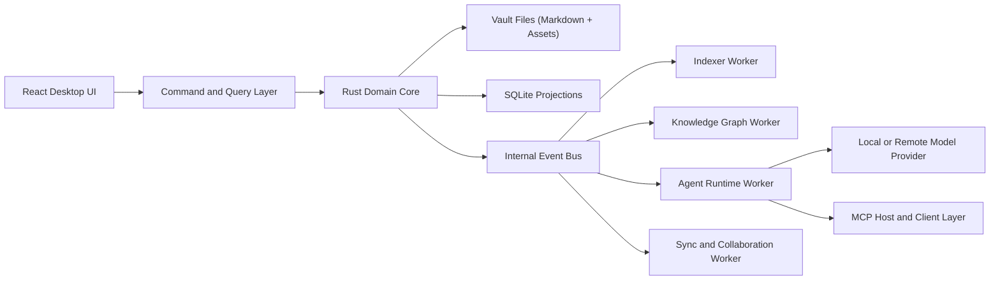

# Thoughtforge Architecture

## 1. Executive Summary

Build Thoughtforge as a local-first modular monolith with strong internal boundaries, background workers, and a typed tool layer for agent access.

Do not start with microservices.

The system is unusual because it has to be both:

- an excellent personal knowledge application for humans
- a safe, inspectable context and action environment for agents

That combination pushes the architecture toward:

- a strong local application core
- portable user-owned file formats
- explicit trust boundaries
- rebuildable projections
- event-driven background processing

## 2. Selected Stack

### 2.1 Application Shell

- Tauri 2 for desktop shell
- Rust for trusted core logic, native integrations, indexing orchestration, and permissions

Reason:

- smaller binary footprint than bundling Chromium
- clearer trust boundary between frontend and native core
- good plugin and platform integration path

### 2.2 Frontend

- React 19
- TypeScript
- Vite
- Zustand for lightweight UI state

Reason:

- mature desktop app ecosystem
- good editor integration story
- fast iteration with typed UI code

### 2.3 Editor

- Tiptap as the editor framework
- ProseMirror as the document engine underneath
- Markdown serialization as the canonical export/import boundary

Reason:

- headless and extensible
- schema-driven
- strong support for custom block types, slash commands, and embeddings

### 2.4 Local-First Collaboration and Merge Model

- Yjs CRDT layer for note collaboration and conflict convergence

Reason:

- conflict-free merge semantics
- network-agnostic sync model
- useful even before full real-time collaboration because it gives a durable merge strategy

### 2.5 Persistence

- Markdown files for authored notes
- SQLite for indexes, graph projections, task projections, caches, audit log, and embeddings metadata
- Asset folder structure for attachments

Reason:

- keeps authored data portable
- uses SQLite where it is strongest: local queries, transactions, projections, and indexes

### 2.6 Search

- SQLite FTS5 for lexical search
- optional embedding-based semantic retrieval as a second ranking layer

Reason:

- FTS5 gives phrase, prefix, boolean, relevance-ranked search in-process
- semantic retrieval should enhance, not replace, lexical search

### 2.7 Agent Runtime

- Provider abstraction in Rust
- Local provider adapter for Ollama first
- Remote provider adapters behind explicit settings
- MCP host/client compatibility for tool and context interoperability

Reason:

- provider flexibility
- local/private mode support
- alignment with broader agent ecosystem

## 3. Architectural Style

### 3.1 Top-Level Style

Use a modular monolith with bounded contexts and asynchronous workers.

This means:

- one desktop application
- one trusted native core process
- one frontend app
- several internal modules with strict APIs
- background jobs for indexing, extraction, and agent tasks

This is the right shape because:

- the product is heavily local and stateful
- the main complexity is domain coordination, not horizontal scale
- shipping faster matters more than distributed deployment
- permissioning is easier when there is one authoritative host process

### 3.2 Internal Design Pattern

Use ports-and-adapters plus event-driven projections.

Recommended split:

- Domain core: workspace, notes, links, entities, tasks, intents, permissions
- Application services: commands, orchestration, workflows
- Adapters: filesystem, SQLite, model providers, MCP, OS integrations, sync backends
- Projections: search index, graph index, task index, embeddings index, audit history

## 4. System Topology



## 5. Bounded Contexts

### 5.1 Workspace Context

Responsibilities:

- open and manage vaults
- watch filesystem changes
- map stable note IDs to file paths
- maintain workspace settings and policies

### 5.2 Editor Context

Responsibilities:

- note editing session state
- block structure
- markdown round-tripping
- command palette insertion and formatting

### 5.3 Graph and Entity Context

Responsibilities:

- backlinks
- typed entities
- relation extraction
- graph neighborhood queries

### 5.4 Search Context

Responsibilities:

- lexical indexing
- semantic chunk indexing
- result ranking
- saved searches and dynamic collections

### 5.5 Task and Intent Context

Responsibilities:

- tasks
- projects
- goals
- review flows
- status and scheduling projections

### 5.6 Agent Runtime Context

Responsibilities:

- retrieval
- tool execution
- proposal generation
- permission checks
- provenance and audit logging

### 5.7 Sync and Collaboration Context

Responsibilities:

- change propagation
- CRDT state
- conflict handling
- adapter-based sync transport

### 5.8 Plugin Context

Responsibilities:

- command registration
- view contribution
- background jobs
- restricted API exposure

## 6. Data Model Strategy

### 6.1 Canonical Data

Canonical user-authored data should be:

- Markdown notes
- frontmatter metadata
- asset files

This keeps the workspace durable and portable.

### 6.2 Derived Data

Derived data should live in SQLite:

- note registry
- backlinks
- task projections
- entity and relation tables
- search indexes
- semantic chunk metadata
- audit and job history

Important rule:

Derived data must be rebuildable.

### 6.3 Stable Identity

Each note, block, entity, task, and intent should receive a stable internal ID. File paths and titles are mutable labels, not identity.

This prevents rename breakage and makes agent operations safer.

## 7. Command, Event, and Query Flow

Recommended pattern:

1. UI issues a typed command.
2. Application service validates permissions and invariants.
3. Domain core updates canonical state or schedules work.
4. Domain events are emitted.
5. Projection workers update search, graph, and task indexes.
6. UI reads via query models optimized for rendering.

This prevents the UI from directly mutating low-level persistence details.

## 8. Agent Architecture

### 8.1 Core Rule

Agents should never talk to the filesystem or database directly. They should use typed tools exposed by the host.

Required agent tools:

- search_notes
- read_note
- read_selection
- list_backlinks
- list_tasks
- create_note
- propose_note_patch
- apply_note_patch
- create_task
- update_task
- extract_entities
- resolve_entity
- open_intent

### 8.2 Permission Model

Separate actions into scopes:

- read-only
- create
- modify
- destructive
- external side effects
- executable integrations

Each agent run should declare requested scopes up front.

### 8.3 Provenance Model

Every agent output should store:

- input note IDs or passages
- model/provider
- prompt or tool plan reference
- timestamp
- resulting diff or artifact

This is mandatory for trust.

## 9. Sync and Collaboration Strategy

### 9.1 v1 Recommendation

Ship offline-first single-user robustness first.

### 9.2 v2 Recommendation

Add Yjs-based collaboration and sync adapters once the note identity, block identity, and projection rebuild flows are stable.

### 9.3 Why Not Cloud-First

Cloud-first architecture would undermine the product thesis:

- weaker user ownership
- worse privacy story
- more complex trust model
- slower local responsiveness

## 10. Security Model

Use explicit trust boundaries:

- Frontend is less trusted.
- Native core is trusted.
- Plugins are less trusted than core.
- Remote providers are untrusted with respect to sensitive user data unless explicitly allowed.

Core security controls:

- permissioned command surface
- least-privilege tool scopes
- secure secret storage
- no-send folders and redaction rules
- explicit approval for destructive or external actions
- audit logs for all agent modifications

## 11. Suggested Repository Layout

```text
apps/
  desktop/             # Tauri app and React shell
crates/
  app-core/            # Command layer, permissions, orchestration
  domain/              # Notes, tasks, intents, entities, policies
  vault/               # File watching, markdown IO, asset management
  indexer/             # Search and graph projections
  agent-runtime/       # Model adapters, tools, provenance, approvals
  sync/                # Yjs and sync adapters
  plugin-host/         # Sandbox and extension APIs
packages/
  ui/                  # Design system and shared UI
  editor/              # Tiptap extensions and markdown bridge
  shared-types/        # Types used by app and UI
docs/
```

## 12. Architecture Decisions to Lock Early

Lock these before implementation accelerates:

1. Canonical markdown format and metadata conventions
2. Stable ID strategy for notes and blocks
3. Permission and approval model for agent actions
4. Projection rebuild strategy
5. Plugin sandbox shape
6. Sync boundary between canonical files and CRDT documents
7. Provenance schema for agent-generated content

## 13. Alternatives Considered

### 13.1 Electron Instead of Tauri

Not recommended as the default choice.

Reason:

- larger bundles
- weaker differentiation on security and system-trust posture
- less alignment with a native core that needs strict permissions

### 13.2 Pure Database Store Instead of Markdown Files

Not recommended.

Reason:

- worse portability
- harder migration from Obsidian
- weaker trust with advanced users

### 13.3 Microservices

Not recommended.

Reason:

- complexity without product benefit at this stage
- harder local-first operation
- slower iteration

## 14. Final Recommendation

If the goal is "an Obsidian-equivalent or better second brain for an agentic OS", the right architecture is:

- Tauri 2 + Rust core
- React 19 + TypeScript UI
- Tiptap and ProseMirror editor
- Markdown canonical storage
- SQLite projections and FTS5 search
- Yjs for merge and collaboration
- provider-agnostic agent runtime with MCP interoperability
- modular monolith with strong trust boundaries
