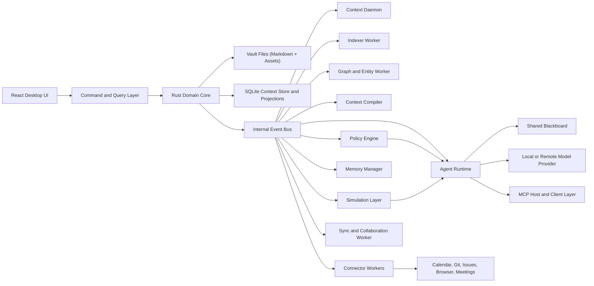

# Thoughtforge Architecture

## 1. Executive Summary

Build Thoughtforge as a local-first modular monolith with strong internal boundaries, background workers, and a typed tool layer for agent access.

Do not build a note app with an AI sidebar.

Build a cognitive control plane that:

- stores user-authored evidence in portable formats
- promotes goals, decisions, commitments, constraints, and permissions to first-class state
- continuously reconciles local and external changes into a live context model
- compiles task-specific context bundles for agents
- preserves provenance, freshness, confidence, and authority
- allows agents to act only through policy-governed typed tools

That combination pushes the architecture toward:

- a strong local application core
- portable user-owned evidence files
- canonical context objects with stable identities
- continuous state reconciliation
- explicit trust boundaries
- rebuildable projections and indexes
- event-driven background processing

## 2. Selected Stack

### 2.1 Application Shell

- Tauri 2 for desktop shell
- Rust for trusted core logic, native integrations, orchestration, and permissions

Reason:

- smaller binary footprint than bundling Chromium
- clearer trust boundary between frontend and native core
- strong alignment with a secure local-first product

### 2.2 Frontend

- React 19
- TypeScript
- Vite
- Zustand for lightweight UI state

Reason:

- mature desktop app ecosystem
- good editor integration story
- fast iteration with typed UI code

### 2.3 Editor

- Tiptap as the editor framework
- ProseMirror as the document engine underneath
- Markdown serialization as the canonical evidence boundary

Reason:

- headless and extensible
- schema-driven
- strong support for custom block types, slash commands, and embeddings

### 2.4 Local-First Collaboration and Merge Model

- Yjs CRDT layer for collaborative convergence and conflict handling

Reason:

- conflict-free merge semantics
- network-agnostic sync model
- useful even before full real-time collaboration because it gives a durable merge strategy

### 2.5 Persistence

- Markdown files for authored evidence
- SQLite for canonical context objects, live models, working sets, memory layers, policies, state deltas, projections, caches, audit logs, and embeddings metadata
- Asset folder structure for attachments

Reason:

- keeps user-authored evidence portable
- lets structured context and policy be modeled explicitly rather than inferred every time
- uses SQLite where it is strongest: local queries, transactions, projections, and indexes

### 2.6 Search and Retrieval

- SQLite FTS5 for lexical search
- optional embedding-based retrieval as a second ranking layer
- graph, recency, working-set, and policy signals for ranking

Reason:

- FTS5 gives phrase, prefix, boolean, relevance-ranked search in-process
- semantic retrieval should enhance, not replace, lexical search
- context quality depends on combining text, structure, time, and active state

### 2.7 Agent Runtime

- provider abstraction in Rust
- local provider adapter for Ollama first
- remote provider adapters behind explicit settings
- MCP host/client compatibility for tool and context interoperability

Reason:

- provider flexibility
- local/private mode support
- alignment with broader agent ecosystem

## 3. Architectural Style

### 3.1 Top-Level Style

Use a modular monolith with bounded contexts and asynchronous workers.

This means:

- one desktop application
- one trusted native core process
- one frontend app
- several internal modules with strict APIs
- background jobs for indexing, reconciliation, compilation, simulation, and agent tasks

This is the right shape because:

- the product is heavily local and stateful
- the main complexity is domain coordination, not horizontal scale
- shipping faster matters more than distributed deployment
- permissioning is easier when there is one authoritative host process

### 3.2 Internal Design Pattern

Use ports-and-adapters plus event-driven projections.

Recommended split:

- Domain core: workspace, evidence, objects, policies, models, relationships
- Application services: commands, orchestration, workflows, review gates
- Adapters: filesystem, SQLite, model providers, MCP, OS integrations, sync backends, external connectors
- Projections: search index, graph index, working set index, freshness index, authority index, embeddings index, audit history

## 4. System Topology



## 5. Bounded Contexts

### 5.1 Workspace Context

Responsibilities:

- open and manage vaults
- watch filesystem changes
- map stable evidence IDs to file paths
- maintain workspace settings and policies

### 5.2 Evidence and Authoring Context

Responsibilities:

- note editing session state
- block structure
- markdown round-tripping
- source passages and evidence ingestion

### 5.3 Context Object Context

Responsibilities:

- first-class objects such as intents, projects, tasks, decisions, commitments, assumptions, resources, constraints, conversations, delegations, approvals, and state deltas
- object relationships and lifecycle
- stable IDs and reference integrity
- promotion of evidence into structured objects

### 5.4 Self and World Model Context

Responsibilities:

- self model for user preferences, communication style, risk tolerance, and working style
- world model for people, projects, systems, commitments, and dependencies
- explicit distinction between user truth, imported truth, inference, and temporary state

### 5.5 Temporal and Attention Model Context

Responsibilities:

- deadlines, rhythms, validity windows, and review cycles
- active focus state
- deferrals, interruptions, blocking conditions, and noise management
- working set assembly and ranking

### 5.6 Search and Retrieval Context

Responsibilities:

- lexical indexing
- semantic chunk indexing
- result ranking
- freshness-aware retrieval
- saved searches and dynamic collections

### 5.7 Graph and Entity Context

Responsibilities:

- backlinks
- typed entities
- relation extraction
- graph neighborhood queries
- confidence and provenance tracking

### 5.8 Memory Context

Responsibilities:

- scratch, session, project, personal, and canonical memory layers
- promotion rules and auditability
- conflict detection between memory layers

### 5.9 Context Daemon Context

Responsibilities:

- observe workspace and connector events continuously
- reconcile new information into the live model
- detect drift between plans and reality
- emit state deltas and candidate updates

### 5.10 Context Compiler Context

Responsibilities:

- compile task-specific context bundles
- explain why each piece of context was selected
- detect missing information
- rank evidence, objects, recent events, and external resources together

### 5.11 Policy and Delegation Context

Responsibilities:

- define delegation ladders
- enforce approval requirements
- gate memory promotion and external side effects
- expose machine-readable execution boundaries

### 5.12 Simulation and Preview Context

Responsibilities:

- preview multi-step plans before execution
- estimate affected objects and external side effects
- surface uncertainty and rollback expectations

### 5.13 Agent Runtime Context

Responsibilities:

- retrieval
- tool execution
- proposal generation
- permission checks
- provenance and audit logging
- blackboard coordination for multiple agents or subtasks

### 5.14 External Connector Context

Responsibilities:

- calendar sync
- git and GitHub mirrors
- issue tracker mirrors
- browser research capture
- transcript and meeting imports

### 5.15 Sync and Collaboration Context

Responsibilities:

- change propagation
- CRDT state
- conflict handling
- adapter-based sync transport

### 5.16 Plugin Context

Responsibilities:

- command registration
- view contribution
- background jobs
- restricted API exposure

## 6. Data Model Strategy

### 6.1 Canonical Authored Evidence

Canonical user-authored evidence should be:

- Markdown notes
- frontmatter metadata
- attachments
- clipped pages and transcripts

This keeps the workspace durable and portable.

### 6.2 Canonical Context Objects

Thoughtforge should maintain canonical local records for:

- intents
- projects
- tasks
- decisions
- commitments
- assumptions
- open questions
- entities
- resources
- constraints
- conversations
- delegations
- approvals
- state deltas

These objects should have stable IDs and explicit relationships.

### 6.3 Live Models

The system should maintain editable, inspectable local models for:

- self model
- world model
- temporal model
- attention model
- execution model

These models should be first-class state, not hidden prompt templates.

### 6.4 Memory Layers

The system should model distinct memory layers:

- scratch memory for ephemeral agent work
- session memory for current run context
- project memory for durable project state
- personal memory for user preferences and patterns
- canonical memory for approved context and authored truth

Each layer needs explicit write and promotion rules.

### 6.5 Derived Data and Projections

Derived data should live in SQLite:

- evidence registry
- backlinks
- working set projections
- task, commitment, and decision projections
- entity and relation tables
- search indexes
- freshness and authority markers
- semantic chunk metadata
- audit and job history

Important rule:

Derived data must be rebuildable from canonical evidence, canonical context objects, live models, and explicit sync state.

### 6.6 Stable Identity

Each note, block, entity, task, decision, commitment, delegation, approval, and intent should receive a stable internal ID. File paths and titles are mutable labels, not identity.

This prevents rename breakage and makes agent operations safer.

### 6.7 Bitemporal State

Important state should support both:

- when it was recorded
- when it was true or intended to take effect

This prevents stale context from being treated as current truth.

### 6.8 Provenance, Freshness, Confidence, and Authority

Every extracted fact or compiled context item should carry:

- provenance
- freshness
- confidence
- authority class

This lets the system distinguish current directives from stale notes and authoritative records from loose speculation.

## 7. Command, Event, and Query Flow

Recommended pattern:

1. UI issues a typed command.
2. Application service validates permissions, invariants, and policy context.
3. Domain core updates evidence, context objects, models, or schedules work.
4. Domain events are emitted.
5. Context daemon and projection workers reconcile search, graph, working set, freshness, and authority indexes.
6. Context compiler assembles bundles for agent or UI workflows.
7. Policy engine and simulation layer evaluate risky or delegated actions.
8. UI reads via query models optimized for rendering and review.

This prevents the UI from directly mutating low-level persistence details.

## 8. Agent Architecture

### 8.1 Core Rule

Agents should never talk to the filesystem or database directly. They should use typed tools exposed by the host and consume compiled context bundles rather than raw global state.

Required agent tools:

- search_evidence
- read_note
- read_selection
- open_working_set
- inspect_self_model
- inspect_world_model
- compile_context_bundle
- list_projects
- list_tasks
- list_decisions
- list_commitments
- list_constraints
- list_resources
- list_open_questions
- create_note
- propose_note_patch
- apply_note_patch
- create_task
- update_task
- create_decision
- create_commitment
- record_assumption
- update_project_state
- promote_block_to_object
- request_approval
- create_delegation
- validate_context_freshness
- simulate_plan
- open_intent

### 8.2 Permission Model

Separate actions into scopes:

- read-only
- create
- modify
- destructive
- external side effects
- executable integrations
- memory promotion
- delegation escalation

Each agent run should declare requested scopes up front.

### 8.3 Delegation Ladder

The system should support a bounded delegation ladder:

- suggest-only
- draft-and-wait
- bounded multi-step execution
- policy-limited autonomous execution

The default should remain conservative.

### 8.4 Provenance Model

Every agent output should store:

- input evidence IDs or passages
- context bundle identifier
- selected model/provider
- tool plan reference
- timestamp
- resulting diff or artifact

This is mandatory for trust.

### 8.5 Memory Policy

Agents may write to scratch or session memory by default. Promotion into project, personal, or canonical memory must follow explicit rules and, when necessary, user approval.

### 8.6 Shared Blackboard

The agent runtime should support a shared blackboard for coordination between subtasks or multiple agents without making chat history the primary substrate.

## 9. Context Daemon and Simulation

### 9.1 Context Daemon

The context daemon should:

- observe notes, objects, and connector events
- reconcile new information into live models
- detect state drift
- produce candidate updates and state deltas
- prepare likely next-step context bundles proactively

### 9.2 Simulation Layer

The simulation layer should:

- preview multi-step plans
- identify affected objects and external tools
- estimate risk and missing context
- support user review before execution

## 10. Sync and Collaboration Strategy

### 10.1 v1 Recommendation

Ship offline-first single-user robustness first.

### 10.2 v2 Recommendation

Add Yjs-based collaboration and sync adapters once stable IDs, live models, policy rules, and projection rebuild flows are stable.

### 10.3 Why Not Cloud-First

Cloud-first architecture would undermine the product thesis:

- weaker user ownership
- worse privacy story
- more complex trust model
- slower local responsiveness

## 11. Security Model

Use explicit trust boundaries:

- Frontend is less trusted.
- Native core is trusted.
- Plugins are less trusted than core.
- Remote providers are untrusted with respect to sensitive user data unless explicitly allowed.

Core security controls:

- permissioned command surface
- least-privilege tool scopes
- secure secret storage
- no-send folders and redaction rules
- explicit approval for destructive or external actions
- approval rules for memory promotion
- delegation ladder enforcement
- audit logs for all agent modifications

## 12. Suggested Repository Layout

```text
apps/
  desktop/             # Tauri app and React shell
crates/
  app-core/            # Command layer, permissions, orchestration
  domain/              # Evidence, objects, models, policies, relationships
  vault/               # File watching, markdown IO, asset management
  context-model/       # First-class objects and schemas
  context-daemon/      # Continuous reconciliation and drift detection
  context-compiler/    # Bundle assembly and explanation
  policy-engine/       # Delegation ladders, approvals, execution rules
  simulation/          # Plan preview and risk estimation
  indexer/             # Search, graph, freshness, working set projections
  agent-runtime/       # Model adapters, tools, provenance, approvals
  connectors/          # Calendar, git, issues, browser, meeting adapters
  sync/                # Yjs and sync adapters
  plugin-host/         # Sandbox and extension APIs
packages/
  ui/                  # Design system and shared UI
  editor/              # Tiptap extensions and markdown bridge
  shared-types/        # Types used by app and UI
docs/
```

## 13. Architecture Decisions to Lock Early

Lock these before implementation accelerates:

1. canonical markdown and evidence conventions
2. stable ID strategy for notes, blocks, and context objects
3. canonical object schema for decisions, commitments, constraints, delegations, and approvals
4. self, world, temporal, attention, and execution model schema
5. memory layer write and promotion rules
6. context daemon event contract and reconciliation rules
7. context compiler input contract and explanation format
8. freshness, confidence, authority, and bitemporal schema
9. permission and approval model for agent actions
10. simulation semantics for risky workflows
11. plugin sandbox shape
12. sync boundary between evidence files, context objects, live models, and CRDT documents

## 14. Alternatives Considered

### 14.1 Electron Instead of Tauri

Not recommended as the default choice.

Reason:

- larger bundles
- weaker differentiation on security and system-trust posture
- less alignment with a native core that needs strict permissions

### 14.2 Pure Database Store Instead of User-Owned Evidence Files

Not recommended.

Reason:

- worse portability
- harder migration from Obsidian
- weaker trust with advanced users

### 14.3 Microservices

Not recommended.

Reason:

- complexity without product benefit at this stage
- harder local-first operation
- slower iteration

## 15. Final Recommendation

If the goal is "the closest thing to human-AI symbiosis short of a neural link", the right architecture is:

- Tauri 2 + Rust core
- React 19 + TypeScript UI
- Tiptap and ProseMirror editor
- Markdown canonical evidence storage
- SQLite context store and FTS5 search
- Yjs for merge and collaboration
- first-class context objects and live models
- a context daemon that continuously reconciles state
- a context compiler that builds task-specific bundles
- a policy and delegation engine
- a simulation layer for risky actions
- provider-agnostic agent runtime with MCP interoperability
- modular monolith with strong trust boundaries
